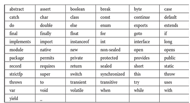

# ***Part 2: An Overview of Java***
---
1. ### *OOP* : cốt lõi của java. 
2. ### *separator* (ký hiệu phân cách) - Những ký hiệu này giúp Java xác định cấu trúc chương trình, phân tách các phần tử, và đảm bảo cú pháp rõ ràng.
 

Ký hiệu | Tên gọi tiếng Việt | Mô tả chức năng
--------|---------------------------|----------------------------------------------------------------------------------|
| `()`   | Dấu ngoặc tròn (Parentheses) | Dùng để chứa danh sách tham số trong định nghĩa và lời gọi phương thức. Cũng được dùng để xác định độ ưu tiên trong biểu thức, chứa biểu thức trong các câu lệnh điều khiển, và bao quanh các kiểu ép (cast types). |
| `{}`   | Dấu ngoặc nhọn (Braces)      | Dùng để chứa các giá trị của mảng khởi tạo tự động. Cũng dùng để định nghĩa một khối mã, cho lớp, phương thức và phạm vi cục bộ. |
| `[]`   | Dấu ngoặc vuông (Brackets)   | Dùng để khai báo kiểu mảng. Cũng được dùng khi truy cập giá trị của mảng.       |
| `;`    | Dấu chấm phẩy (Semicolon)    | Kết thúc câu lệnh.                                                              |
| `,`    | Dấu phẩy (Comma)             | Phân tách các định danh liên tiếp trong khai báo biến. Cũng dùng để nối các câu lệnh lại với nhau bên trong vòng lặp for. |
| `.`    | Dấu chấm (Period)            | Dùng để phân tách tên gói (package) với các gói con (subpackage) và lớp. Cũng được dùng để phân tách biến hoặc phương thức khỏi biến tham chiếu. |
| `::`   | Dấu hai chấm (Colons)        | Dùng để tạo tham chiếu đến phương thức hoặc constructor.                        |
| `...`  | Dấu ba chấm (Ellipsis)       | Chỉ ra tham số có số lượng thay đổi (variable-arity parameter).                |
| `@`    | Ký hiệu @ (At-sign)          | Bắt đầu một annotation.                                                        |
thêm
| `:` | colon | dùng trong for-each, switch , label, ánh xạ dữ ,liệu trong json/annotation hiệu ánh xạ key–value, biểu thức 2 ngôi |
| `->`|  | dùng trong biểu thức lamda

ví dụ: [separator](separator.java)

3. ### *The Java Keywords*  ###

Điều khiển luồng (Control Flow)

        if, else, switch, case, default → rẽ nhánh.

        for, while, do → vòng lặp.

        break, continue → điều khiển vòng lặp.

        return, yield → trả về giá trị hoặc kết quả. 
        Nhưng yield chỉ được dùng trong switch expression 
        /// chỉ được dùng ///

        throw, throws, try, catch, finally → xử lý ngoại lệ.

Kiểu dữ liệu (Data Types)

        Nguyên thủy: byte, short, int, long,
         float, double, char, boolean.

        void → kiểu rỗng (không trả về).

        var → khai báo biến với kiểu được suy luận.

Modifier (Bổ từ)

        Truy cập: public, private, protected.

        Khác: static, final, abstract
        synchronized, transient, volatile, strictfp, native.

OOP (Hướng đối tượng)

        class, interface, enum, record → định nghĩa lớp, 
        giao diện, 
        enum, record. 

        extends, implements → kế thừa & hiện thực.

        super, this → tham chiếu lớp cha & đối tượng hiện tại.

        new → tạo đối tượng.

        instanceof → kiểm tra kiểu. (a intanceof b) = boolean
Module & Access (Java 9+)

        module, open, opens, exports, requires,
         uses, provides, transitive.
        👉 Dùng trong Java Module System (JPMS).

Khác

        assert → kiểm tra điều kiện trong debug.

        goto → từ khóa dự trữ nhưng không dùng.

        const → dự trữ, không dùng.

        package, import → quản lý gói.

🔹 Từ khóa dự trữ nhưng không sử dụng

        goto, const → không bao giờ được dùng.